# A Day in the Life of a SOC Analyst, IOC Triage
## Date 09/16/2025
Recently, I received multiple suspicious files and logs from a coworker for triage. After analysis, several artifacts were confirmed as malicious including phishing campaigns, brute-force IPs, and domains linked to fraudulent activity

## Executive Summary
Threat actors continue to exploit email, brute-force attempts, and phishing domains to infiltrate organizations. As a SOC Analyst, part of my role is to validate and triage Indicators of Compromise (IOCs) shared by colleagues. This ensures we distinguish false positives from legitimate threats and take swift action to safeguard business operations.
During this investigation, multiple suspicious files and logs were analyzed. Several artifacts were confirmed as malicious, including phishing campaigns, brute-force IPs, and domains linked to fraudulent activities.

## "Possible IOC Samples. Please Review"
Inside the email, I find a list of suspicious artifacts gathered during system checks:
### . Download_Updated_Project_Files.eml
### .  PrimeSoft_auth.log
### .  PrimeSoft_firewall.log
### .  PrimeSoft_phishing.eml
### .  Reported_phish_nike.png
### .  Suspicious_email_shina.png
### .  Team_Building_Activity.eml

## Tech Stack
- **Kali Linux** – Investigation environment for IOC analysis
- **VirusTotal** – Malware/file hash checks & reputation lookups
- **AbuseIPDB** – IP enrichment, brute-force & abuse tracking
- **Hybrid Analysis** – Sandbox testing for suspicious files
- **MXToolbox** – Email header, DNS, and SMTP verification

## Investigation Flow
### STEP 1: Download_Updated_Project_Files.eml

On opening the file, it was found to be a suspicious phishing email campaign with the following IOCs 

Ip  =             209.85.216.41
                   10.13.154.136

Url  =                     htts://drive.google.com/uc?export=download&id=1bstuGMLer-fbJbcGG5JiqnlekTSKvq5y
                         
Sender  =      projectdpt@kanzalshamsprojectmgt.com

Receiver  =   nikefury@company.com

## Enrichment of IOCs
Ip    209.85.216.41  Suspicious {Virustotal, Anyrun, Abuseipdb}

Sender  =  projectdpt@kanzalshamsprojectmgt.com      
This domain is different from the receiver domain; if coming from the same organization, it has to be the same domain.

Receiver  =   nikefury@company.com

Email address: Malicious (phishing campaign), True Positive.

## Step 2: File Analysis [ PrimeSoft_phishing.eml]

 microsoftsecure-alert.com This domain is linked to this IP 185.220.101.1
 
Email address: Malicious (phishing campaign), True Positive

## Step3: File Analysis[Team_Building_Activity.eml]

On opening the file, it was found to be a suspicious phishing email with the following IOCs.

Ip   =    209.85.210.182

Url  =    http://theannoyingsite.com.

## Enrichment of IOCs
Url =  http://theannoyingsite.com phishing and malicious, True Positive

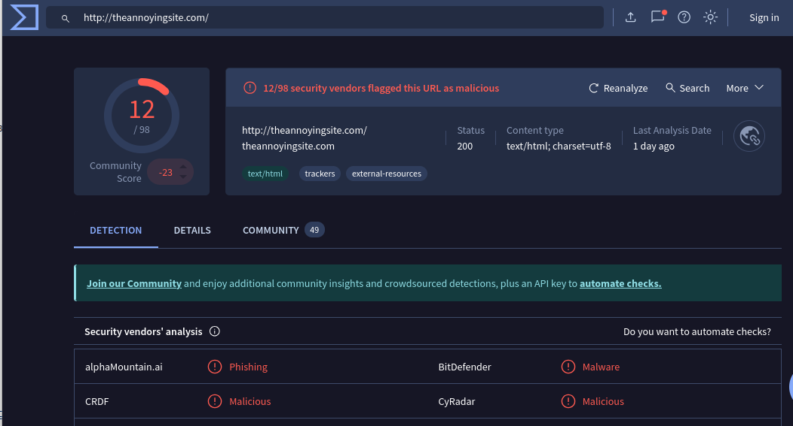
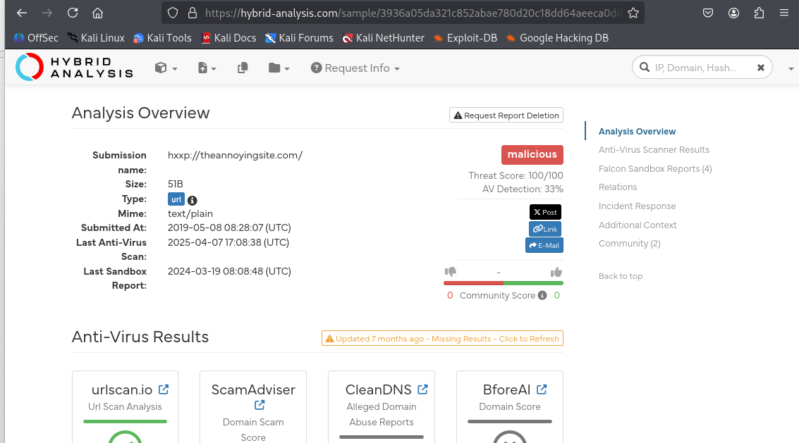

Url =  http://theannoyingsite.com  malicious

Domain and IP Reputation Analysis

The domain theannoyingsite.com, created approximately seven years ago, has been flagged by 10 out of 94 security vendors as malicious.
MITRE ATT&CK™ mapping identified 44 indicators, associated with 24 attack techniques across 8 tactics, indicating a broad malicious footprint.

Further analysis showed that the domain is linked to the IP address 50.116.11.184, which has a High-Risk reputation. Recent activity suggests this IP has been involved in fraudulent or abusive behaviour, as confirmed by IPQS threat intelligence. Based on these findings, the site should be considered unsafe, and users are strongly advised not to access it.

Additionally, the sender and receiver domains in the email do not match, despite the message appearing to come from a teammate this is a common phishing red flag.

A separate IP identified in the investigation, 209.85.210.182, has also been classified as malicious, and this alert is assessed as a True Positive.

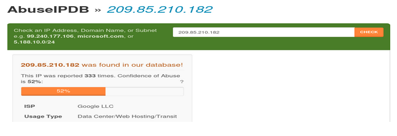
Email: Malicious (phishing campaign), True Positive.

## Step4: File Analysis[PrimeSoft_auth.log]
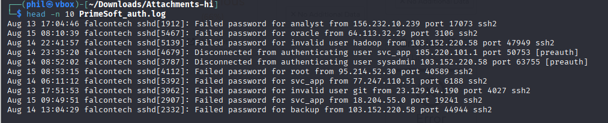

A long list of IPs was seen trying to intrude on the system with Failed password within the 48 hours.
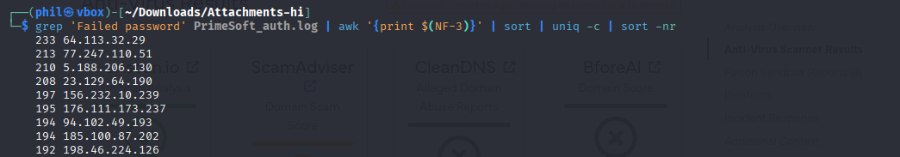

30 unique ip had Failed pasword.

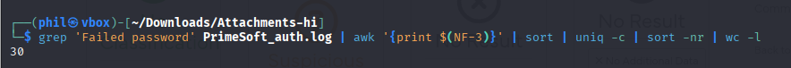.

30 unique ip had Connection closed.

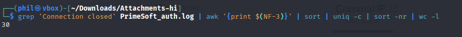. 

30 unique ip had Disconnected

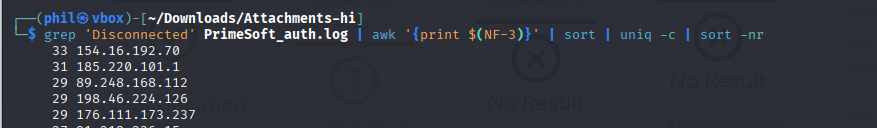

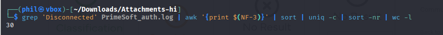

5 unique ip had Accepted pasword
## Enrichment of  IOCs
These IPs with accepted passwords are all internal IPs and were all involved in brute force and port scanning activities

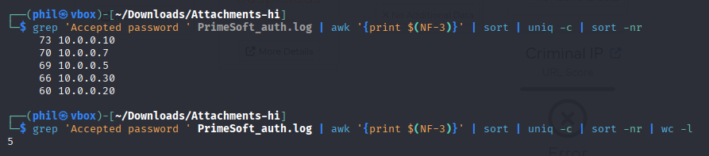
 
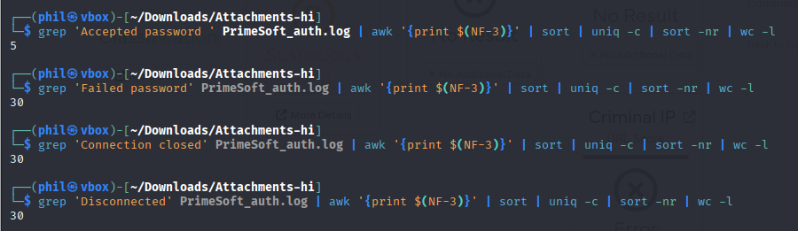

The following IP addresses have been identified as malicious and associated with brute-force attack activity:

64.113.32.26 — Flagged as malware-related and malicious by VirusTotal, AbuseIPDB, and Hybrid Analysis.

77.247.110.51 — Netherlands-based IP, reported as malicious by VirusTotal and AbuseIPDB.

5.188.206.130 — Bulgaria-based IP, classified as malicious and linked to brute-force attempts according to VirusTotal and AbuseIPDB.

These IPs which have been extracted from the prime_auth.log, IOC, demonstrate consistent malicious behavior across multiple threat-intelligence sources.

## Step5: File Analysis[PrimeSoft_firewall.log]

  A long list of IPs were blocked by the firewall, most of them were blocked multiple times within the 48 hours
  

  ## Enrichment  of  IOCs
  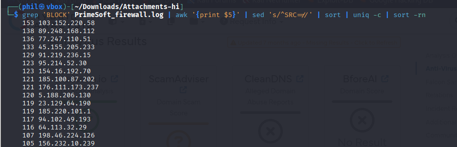

 IP 103.152.220.58       country  Hong Kong, Domain Name is interstellarbd.net, suspicious
 IP 89.248.168.122      1/94 security vendor flagged this IP address as malicious(Virus Total)
 Country  Netherlands
 IP 77.247.110.51          1/94 security vendor flagged this IP address as malicious(Virus Total)
 It was first reported on June 17th, 2021, and the most recent report was 3 years ago
IP 77.247.110.51     was found in our database. This IP was reported 199 times (AbuseIPDB)
 Ip 45.155.205.233
IP 45.155.205.233  was found in our database and has been reported 1612 times (AbuseIPDB) Country  Russian Federation, 19/94 security vendors flagged this IP address as malicious(Virus Total)
 Ip  91.219.236.15  Country  Hungary/  was not found in most databases but is still suspicious, as one vendor has flagged it      as such (ArcSight threat intel.)
These IPs are malicious and are used for brute-force attacks

## Final Triage Report
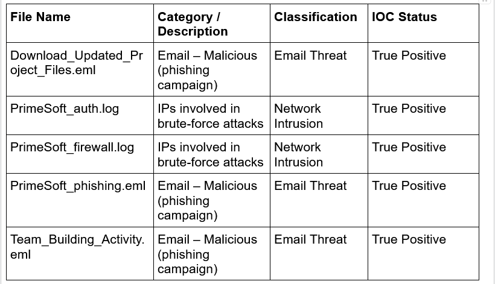

## Key Takeaway
Effective IOC triage isn’t just about spotting bad actors—it’s about validating evidence, enriching with intelligence, and making fast, informed decisions.
As cyber threats evolve, SOC analysts stand as the frontline, ensuring that noise is filtered out and real threats are acted upon swiftly.

##Recommendations

1. Strengthen Email Security

Enforce robust email authentication protocols, including SPF, DKIM, and DMARC.

Conduct regular phishing simulations and ongoing user awareness training to enhance vigilance.

2. Harden Authentication Systems

Implement multi-factor authentication (MFA) for all critical user accounts.

Monitor authentication activity and proactively block repeated failed login attempts at the firewall or IDS.

3. Enhance Threat Intelligence Integration

Automate IOC enrichment using reputable threat-intelligence platforms such as VirusTotal, AbuseIPDB, Hybrid Analysis, and MXToolbox.

Continuously refine and update SIEM correlation rules to improve detection accuracy.

4. Strengthen Network Defense

Block malicious IP addresses and domains identified during triage and investigations.

Apply geo-blocking for high-risk regions when aligned with business requirements and operational needs.

5. Improve Incident Response Playbooks

Develop, document, and regularly test incident response playbooks for scenarios such as phishing, brute-force attempts, and impersonation attacks.

Establish clear escalation procedures to ensure timely response and handling of confirmed threats.

## Conclusion

In summary, this IOC triage exercise highlighted how structured analysis, enrichment, and correlation can effectively convert raw security artifacts into actionable intelligence. The investigation confirmed several phishing emails, malicious domains, and multiple IP addresses associated with brute-force activity as genuine threats rather than false positives. By validating indicators through platforms such as VirusTotal and AbuseIPDB, and by correlating findings with authentication and firewall logs, we were able to accurately assess the immediate risks and prioritize appropriate mitigation measures.

Looking ahead, implementing the recommended controls such as strengthened email authentication (SPF, DKIM, DMARC), multi-factor authentication, automated threat intelligence enrichment, targeted network blocking, and regularly tested incident response playbooks will significantly reduce the organization’s exposure and accelerate the detection-to-remediation lifecycle.

Ultimately, ongoing triage efforts, combined with strong collaboration between the SOC, IT teams, and end users, will enhance organizational resilience against evolving phishing campaigns and intrusion attempts.

