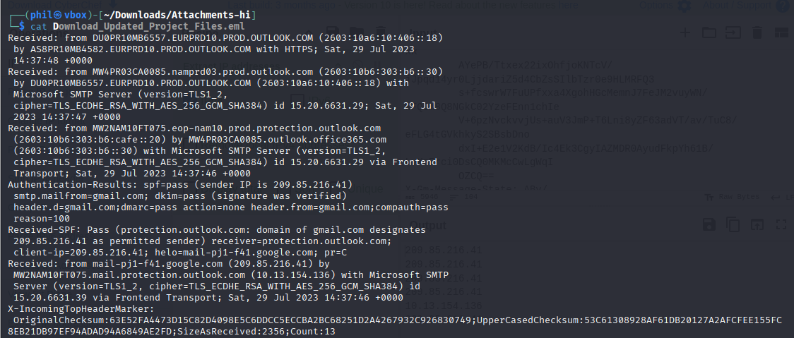
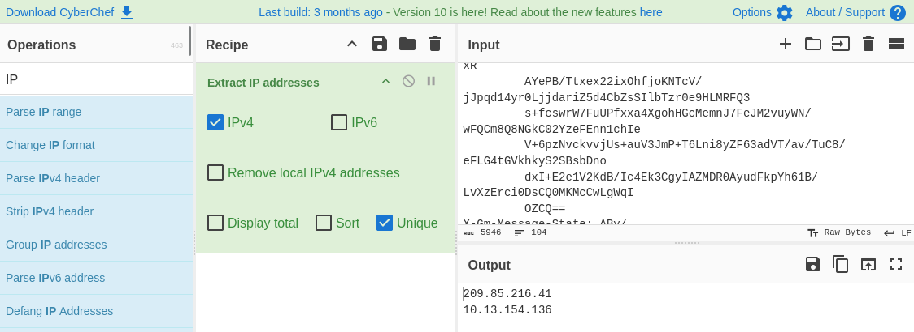
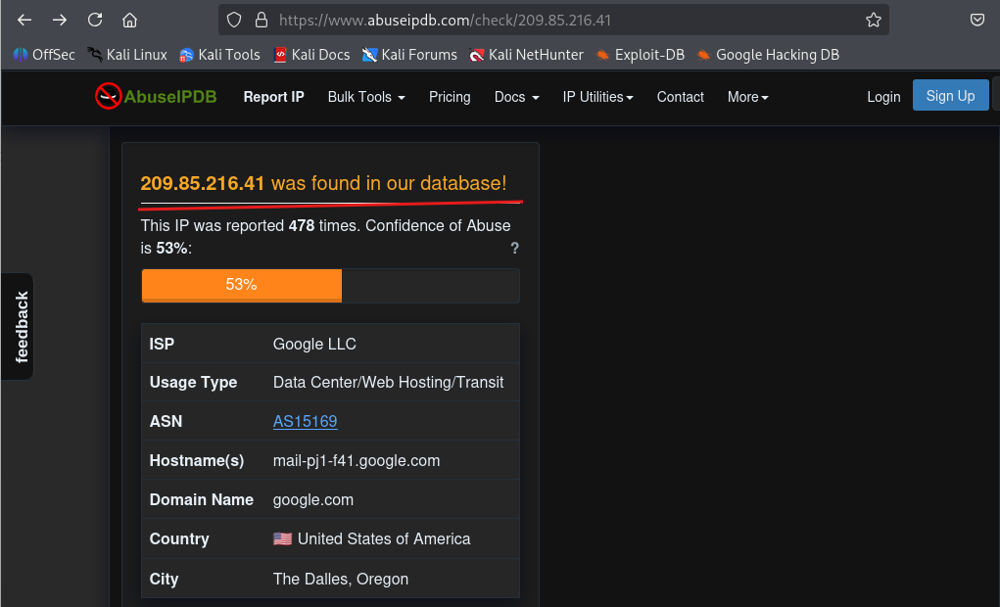
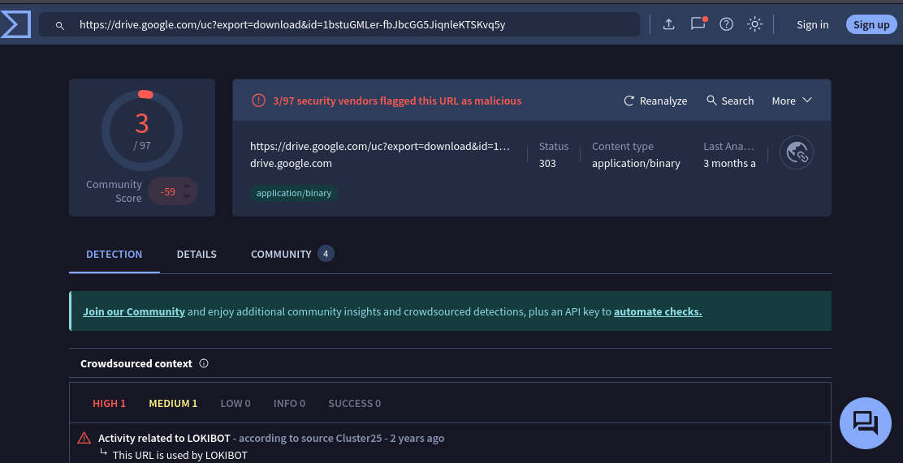
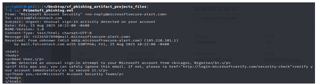
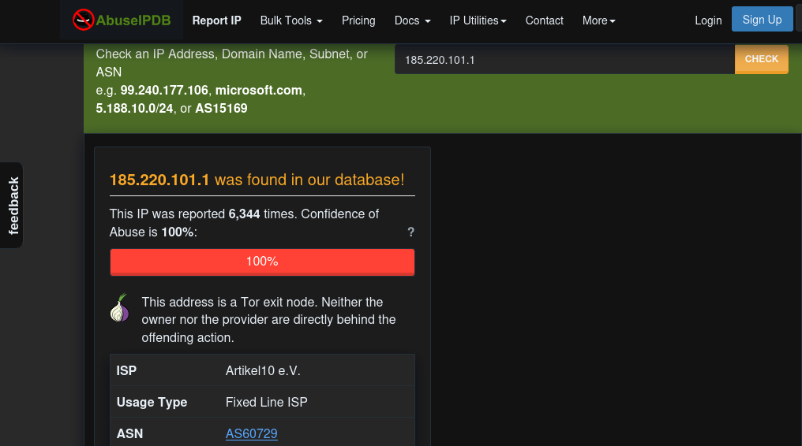

# A Day in the Life of a SOC Analyst, IOC Triage
Recently, I received multiple suspicious files and logs from a coworker for triage. After analysis, several artifacts were confirmed as malicious including phishing campaigns, brute-force IPs, and domains linked to fraudulent activity

## Executive Summary
Threat actors continue to exploit email, brute-force attempts, and phishing domains to infiltrate organizations. As a SOC Analyst, part of my role is to validate and triage Indicators of Compromise (IOCs) shared by colleagues. This ensures we distinguish false positives from legitimate threats and take swift action to safeguard business operations.
During this investigation, multiple suspicious files and logs were analyzed. Several artifacts were confirmed as malicious, including phishing campaigns, brute-force IPs, and domains linked to fraudulent activities.

## "Possible IOC Samples. Please Review"
Inside the email, I find a list of suspicious artifacts gathered during system checks:
### . Download_Updated_Project_Files.eml
### .  PrimeSoft_auth.log
### .  PrimeSoft_firewall.log
### .  PrimeSoft_phishing.eml
### .  Reported_phish_nike.png
### .  Suspicious_email_shina.png
### .  Team_Building_Activity.eml

## Tech Stack
- **Kali Linux** – Investigation environment for IOC analysis
- **VirusTotal** – Malware/file hash checks & reputation lookups
- **AbuseIPDB** – IP enrichment, brute-force & abuse tracking
- **Hybrid Analysis** – Sandbox testing for suspicious files
- **MXToolbox** – Email header, DNS, and SMTP verification

## Investigation Flow
### STEP 1: Download_Updated_Project_Files.eml

On opening the file, it was found to be a suspicious phishing email campaign with the following IOCs 

Ip  =             209.85.216.41
                   10.13.154.136

Url  =                     htts://drive.google.com/uc?export=download&id=1bstuGMLer-fbJbcGG5JiqnlekTSKvq5y
                         
Sender  =      projectdpt@kanzalshamsprojectmgt.com

Receiver  =   nikefury@company.com

## Enrichment of IOCs
Ip    209.85.216.41  Suspicious {Virustotal, Anyrun, Abuseipdb}

Sender  =  projectdpt@kanzalshamsprojectmgt.com      
This domain is different from the receiver domain; if coming from the same organization, it has to be the same domain.

Receiver  =   nikefury@company.com

Email address: Malicious (phishing campaign), True Positive.

## Step 2: File Analysis [ PrimeSoft_phishing.eml]

 microsoftsecure-alert.com This domain is linked to this IP 185.220.101.1
 
Email address: Malicious (phishing campaign), True Positive

Below is the full report. Please see the report below.

# Reprt 
[Report](https://github.com/osehale/A-Day-in-the-Life-of-a-SOC-Analyst-IOC-Triage/blob/main/A%20Day%20in%20the%20Life%20of%20a%20SOC%20Analyst_%20IOC%20Triage.pdf) 
 
